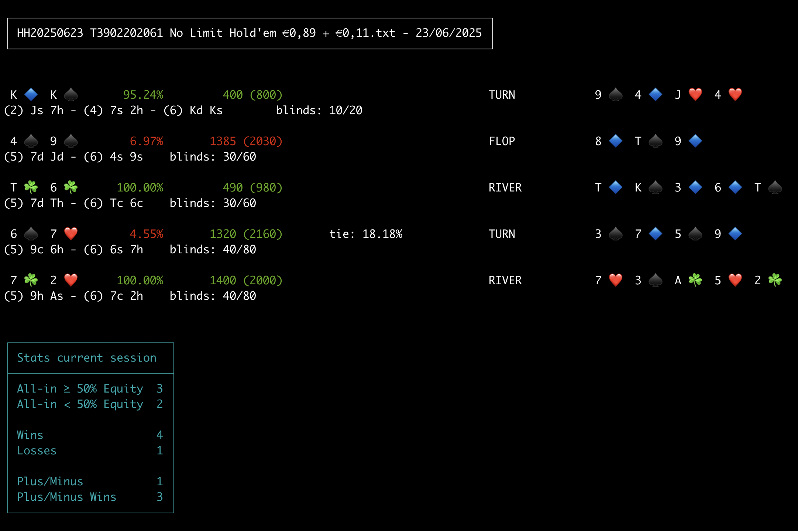

# Poker-Hist-CLI-Parser



## About this project 🎉

This is a small project I created because I love poker and wanted to challenge myself by building a simple script that extracts useful information from poker hand history files.

## What it does

The script parses text files generated by poker platforms like PokerStars and extracts some basic statistics. Currently, the only supported stats focus on **all-in** situations.

## How to use it

To run the script, you need to provide three mandatory inputs:

- **Player name**: The poker player’s name as it appears in the hand history files.
- **Directory**: The folder path where your poker hand history text files are stored.
- **Timestamp**: The starting date/time from which the script will begin parsing the files.

Once you provide these, the script will process the relevant files and display the extracted stats for you to enjoy and analyze.

## Example usage

Before running the script, make sure you have [Node.js](https://nodejs.org/) installed on your computer.

1. Clone this repository and navigate to its root folder:

```bash
git clone <repo-url>
cd <repo-folder>
```

2. Install the required dependencies:

```bash
npm install
```

3. Run the script from the root of the repository with the required parameters:

```bash
node index.js --dir=/Users/janedoe/poker-history/ --timestamp=20250101 --name=JaneDoe
```

This command will parse the files located in the `/Users/janedoe/poker-history/` folder, starting from the date `20250101`, and analyze the all-in statistics for the player named `JaneDoe`.

## How to read the output

Here is an example of the output you may see when running the script:

```text
9 ♠️ T ♠️ ~47.01% 1260 (1080) HOLE CARDS
(1) Ac 8d - (5) 9s Ts blinds: 75/150

K ☘️ Q 🔷 ~42.53% 870 (1740) HOLE CARDS
(1) 8d As - (5) Kc Qd blinds: 90/180
```

### What does this mean?

- The **percentage** (e.g. `~47.01%`) represents your **equity** — your chance of winning the pot with the given hand at that moment.

  - If the percentage is **<span style="color: green;">green</span>**, it means your equity is **greater than or equal to 50%**.
  - If the percentage is **<span style="color: red;">red</span>**, it means your equity is **less than 50%**.

- The numbers like `1260 (1080)` show:

  - **1260**: Your chip count at the time of the all-in.
  - **(1080)**: The size of the pot for that all-in hand.

- The color of the chip count number indicates the result of the all-in:
  - **<span style="color: green;">Green</span>** means you **won** the all-in.
  - **<span style="color: red;">Red</span>** means you **lost** the all-in.

### Additional details

- The cards shown (e.g. `9 ♠️ T ♠️`) are your hole cards.
- The lines like `(1) Ac 8d - (5) 9s Ts` show player positions and their cards.
- The blinds indicate the size of the blinds during that hand.

---

If you want to learn more about poker equity and how it’s calculated, check out these resources:

- [PokerBankrollApp: Understanding Poker Equity](https://www.pokerbankrollapp.com/Understanding-Poker-Equity-A-Simple-Guide-to-Calculating-Your-Winning-Chances/)
- [PokerSciences: Simple Guide to Calculate Poker Equity](https://www.pokersciences.com/en/articles/equity-poker-simple-guide-calculate)

## Credits

This project uses the following open-source libraries:

- **[minimist](https://github.com/minimistjs/minimist)** — A lightweight argument parser for Node.js.  
  Licensed under the MIT License.

- **[poker-odds-calc](https://www.npmjs.com/package/poker-odds-calc)** — A library to calculate poker hand odds.  
  Licensed under the MIT License.

## License

This project is licensed under the MIT License.  
See the [MIT](./LICENSE) file for details.
